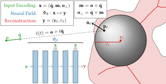

# MARF: The Medial Atom Ray Field Object Representation

<center>



[Publication](https://doi.org/10.1016/j.cag.2023.06.032) | [Arxiv](https://arxiv.org/abs/2307.00037) | [Training data](https://mega.nz/file/9tsz3SbA#V6SIXpCFC4hbqWaFFvKmmS8BKir7rltXuhsqpEpE9wo) | [Network weights](https://mega.nz/file/t01AyTLK#7ZNMNgbqT9x2mhq5dxLuKeKyP7G0slfQX1RaZxifayw)

</center>

**TL;DR:** We achieve _fast_ surface rendering by predicting _n_ maximally inscribed spherical intersection candidates for each camera ray.

---

## Entering the Virtual Environment

The environment is defined in `pyproject.toml` using [Poetry](https://github.com/python-poetry/poetry) and reproducibly locked in `poetry.lock`.
We propose three ways to enter the venv:

```shell
# Requires Python 3.10 and Poetry
poetry install
poetry shell

# Will bootstrap a Miniconda 3.10 environment into .env/ if needed, then run poetry
source .localenv
```


## Evaluation

### Pretrained models

You can download our pre-trained models` from <https://mega.nz/file/t01AyTLK#7ZNMNgbqT9x2mhq5dxLuKeKyP7G0slfQX1RaZxifayw>.
It should be unpacked into the root directory, such that the `experiment` folder gets merged.

### The interactive renderer

We automatically create experiment names with a schema of `{{model}}-{{experiment-name}}-{{hparams-summary}}-{{date}}-{{random-uid}}`.
You can load experiment weights using either the full path, or just the `random-uid` bit.

From the `experiments` directory:

```shell
./marf.py model {{experiment}} viewer
```

If you have downloaded our pre-trained network weights, consider trying:

```shell
./marf.py model nqzh viewer # Stanford Bunny     (single-shape)
./marf.py model wznx viewer # Stanford Buddha    (single-shape)
./marf.py model mxwd viewer # Stanford Armadillo (single-shape)
./marf.py model camo viewer # Stanford Dragon    (single-shape)
./marf.py model ksul viewer # Stanford Lucy      (single-shape)
./marf.py model oxrf viewer # COSEG four-legged  (multi-shape)
```

## Training and Evaluation Data

You can download a pre-computed archive from <https://mega.nz/file/9tsz3SbA#V6SIXpCFC4hbqWaFFvKmmS8BKir7rltXuhsqpEpE9wo>.
It should be extracted into the root directory such that a `data` directory is added to the root directory.

<details>
<summary>
Optionally, you may compute the data yourself.
</summary>

Single-shape training data:

```shell
# takes takes about 23 minutes, mainly due to lucy
download-stanford bunny happy_buddha dragon armadillo lucy
preprocess-stanford bunny happy_buddha dragon armadillo lucy \
	--precompute-mesh-sv-scan-uv \
	--compute-miss-distances \
	--fill-missing-uv-points
```

Multi-shape training data:

```shell
# takes takes about 29 minutes
download-coseg four-legged --shapes
preprocess-coseg four-legged \
	--precompute-mesh-sv-scan-uv \
	--compute-miss-distances \
	--fill-missing-uv-points
```

Evaluation data:

```shell
# takes takes about 2 hour 20 minutes, mainly due to lucy
preprocess-stanford bunny happy_buddha dragon armadillo lucy \
	--precompute-mesh-sphere-scan \
	--compute-miss-distances
```

```shell
# takes takes about 4 hours
preprocess-coseg four-legged \
	--precompute-mesh-sphere-scan \
	--compute-miss-distances
```
</details>


## Training

Our experiments are defined using YAML config files, optionally templated using Jinja2 as a preprocessor.
These templates accept additional input from the command line in the form of `-Okey=value` options.
Our whole experiment matrix is defined in `marf.yaml.j12`. We select between different experiment groups using `-Omode={single,ablation,multi}`, and which experiment using `-Oselect={{integer}}`

From the `experiments` directory:

CPU mode:

```shell
./marf.py model marf.yaml.j2 -Oexperiment_name=cpu_test -Omode=single -Oselect=0 fit
```

GPU mode:

```shell
./marf.py model marf.yaml.j2 -Oexperiment_name=cpu_test -Omode=single -Oselect=0 fit --accelerator gpu --devices 1
```
